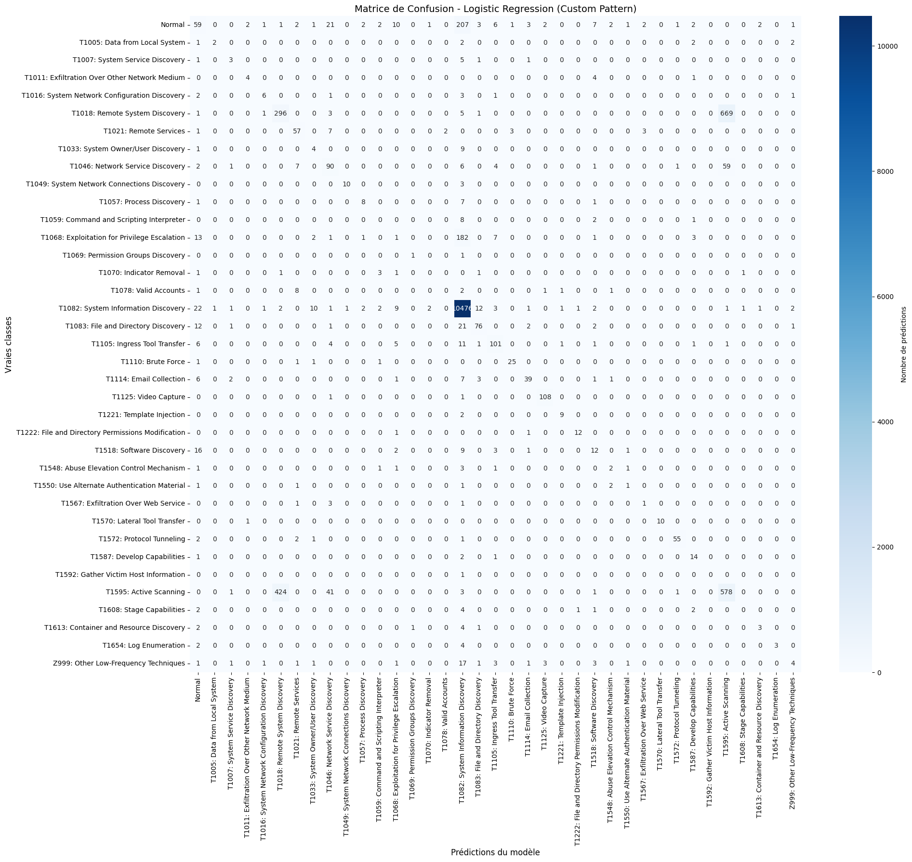

# 🛡️ MITRE ATT&CK Command Classification using ML & Deep Learning

**Python 3.8+** | **TensorFlow 2.0+** | **scikit-learn 1.0+** | **MIT License**

> **From raw command-line telemetry to actionable ATT&CK technique classification**

This project investigates how **command-line process titles (`proctitle`)** can be automatically classified into **MITRE ATT&CK techniques** using both **Machine Learning (ML)** and **Deep Learning (DL)** approaches.

The focus extends beyond model performance to address **realistic threat modeling**, **data imbalance handling**, and **domain-aware feature engineering**—critical components for operational cybersecurity systems.

---

## 🎯 Motivation

Command-line executions are among the strongest indicators of attacker activity on compromised hosts, directly exposing:
- 🔍 **Reconnaissance** patterns
- ↔️ **Lateral movement** behaviors
- 🔒 **Persistence** mechanisms
- ⚡ **Execution** techniques

### The Challenge

Command data presents unique difficulties:
- Commands are **short and noisy**
- Semantics depend on **arguments, flags, paths, and IPs**
- The **same command** may correspond to different ATT&CK techniques
- Datasets are naturally **imbalanced** and frequency-driven

### Our Solution

This project addresses these challenges through:
- ✅ Careful exploratory data analysis
- ⚖️ Frequency-aware learning with sample weighting
- 🔧 Custom tokenization for cyber artifacts
- 📊 Comparative study between ML and DL models

---

## 📊 Dataset Description

### Dataset Origin

The dataset originates from the **Casino Limit Capture-The-Flag (CTF)** challenge—a realistic offensive security scenario where multiple attacking teams operated against a defended infrastructure.

**Key aspects:**
- ✔️ Attacker activity was fully monitored
- ✔️ All executed commands were collected from system logs
- ✔️ Each command was annotated with **MITRE ATT&CK techniques**

**References:**
- [Casino Limit Challenge](https://casinolimit.inria.fr/challenge.html)
- [Dataset Paper](https://inria.hal.science/hal-05224264)

---

### Raw Data Characteristics

Each row represents an **observed command execution pattern** with the following fields:

| Field | Description |
|-------|-------------|
| `proctitle` | The full command-line string as executed |
| `technique` | Original MITRE ATT&CK technique label |
| `technique_grouped` | Consolidated ATT&CK technique for modeling |
| `count` | Number of times this `(proctitle, technique)` pair appeared |

> **⚠️ Important:** The dataset does **not** represent unique commands only. Execution frequency (`count`) is a first-class signal explicitly used during training.

---

### Dataset Statistics

| Metric | Value |
|--------|-------|
| Initial ATT&CK techniques | **67** |
| Final techniques after consolidation | **37** |
| Unique command strings | **~100** |
| Total observations | **70,992** |
| Class imbalance | **High** (reflects real attacker behavior) |

**Distribution highlights:**
- `T1082: System Information Discovery` → 355,723 occurrences (85.2%)
- `T1595: Active Scanning` → 12,321 occurrences (3.0%)
- `Normal` → 5,105 occurrences (1.2%)
- Rare techniques grouped into `Z999: Other Low-Frequency Techniques`

---

### Technique Consolidation Strategy

To ensure meaningful training and stratified splits, rare techniques are grouped into:

**`Z999 — Other Low-Frequency Techniques`**

This grouping:
- ✅ Prevents extreme overfitting on rare classes
- ✅ Avoids empty classes in validation/test splits
- ✅ Preserves semantic interpretability

> **📝 Note:** Apparent duplicates after grouping are **expected and intentional**—they represent different techniques mapping to the same command or frequency aggregation, not data leakage.

---

### Dataset Availability

```
data/
├── raw/                  # Full processed dataset
├── sample/               # Lightweight CSV for quick inspection
└── README.md            # Additional dataset documentation
```

---

## 🔬 Methodology Overview

### 1️⃣ Exploratory Data Analysis (EDA)

**📓 Notebook:** `notebooks/01_eda.ipynb`

**Objectives:**
- Inspect dataset structure and types
- Analyze technique distributions
- Understand the semantic meaning of the `count` column
- Validate the need for frequency-weighted learning
- Consolidate `(proctitle, technique_grouped)` pairs by summing counts

**💡 Key Insight:**
> In cybersecurity telemetry, frequency is part of the signal, not noise.

---

### 2️⃣ Machine Learning Baseline (TF-IDF + Logistic Regression)

**📓 Notebook:** `notebooks/02_ml_lr.ipynb`

#### Feature Engineering

Commands are vectorized using **TF-IDF (unigrams + bigrams)** with a custom token pattern that preserves:
- 🌐 IP addresses and ports (`10.35.108.10:22`)
- 🔗 URLs (`http://malicious.com/exploit.sh`)
- 📁 Filesystem paths (`/etc/passwd`, `/tmp/file[1].txt`)
- 🚩 Command flags (`--color=auto`, `-la`)
- 💲 Environment variables (`$HOME`, `${PATH}`)

**Example tokenization:**
```
cat /etc/passwd              → ['cat', '/etc/passwd']
ssh user@10.35.108.10:22     → ['ssh', 'user@10.35.108.10', '22']
wget http://malicious.com    → ['wget', 'http://malicious.com']
```

#### Training Strategy

- **Split:** 60% train / 20% validation / 20% test (stratified)
- **Sample weights:** Execution count from the `count` column
- **Evaluation:** Weighted accuracy and F1-score
- **Hyperparameter tuning:** GridSearchCV with 3-fold CV

#### Results

| Model | Accuracy | F1-Score (Weighted) |
|-------|----------|---------------------|
| Default LR | 70.84% | 79.08% |
| **Optimized LR** | **85.02%** | **83.58%** |

**Best hyperparameters:**
- `C=10`
- `penalty='l2'`
- `solver='lbfgs'`
- `class_weight=None`
- `max_iter=1000`

**Performance characteristics:**
- ✅ Strong and stable weighted performance
- ✅ High accuracy on frequent techniques
- ✅ High interpretability and low computational cost
- ⚠️ Confusions mainly between semantically close ATT&CK techniques

**Confusion Matrix:**



*The confusion matrix shows strong diagonal performance, indicating accurate classification across most ATT&CK techniques. The model achieves 12,070 correct predictions out of 14,197 total test samples (85.02% accuracy).*

This makes the ML model a **robust baseline** for operational environments.

---

### 3️⃣ Deep Learning Baseline (Tokenizer + LSTM)

**📓 Notebook:** `notebooks/03_dl_lstm.ipynb`

#### Preprocessing

**Tokenizer configuration:**
- `num_words=5000`
- `oov_token="<unk>"`
- `lower=True`

**Sequence preprocessing:**
- `MAX_SEQUENCE_LENGTH = 20`
- `pad_sequences(..., padding='post', truncating='post')`

**Label handling:**
- LabelEncoder + one-hot encoding (`to_categorical`)
- Prevents false ordinal relationships between class indices
- Matches softmax output format for proper training

#### Model Architecture

```python
Sequential([
    Embedding(VOCAB_SIZE, 100, input_length=20),
    LSTM(64),
    Dropout(0.5),
    Dense(37, activation='softmax')
])
```

**Training configuration:**
- Optimizer: `adam`
- Loss: `categorical_crossentropy`
- Early stopping on `val_loss` (patience=3, restore_best_weights)
- Epochs: 10, Batch size: 32
- Sample weights applied

#### Results

| Metric | Value |
|--------|-------|
| **Accuracy** | **83.45%** |
| **F1-Score (Weighted)** | **78.54%** |

**Classification Report:**

```
                                              precision  recall  f1-score  support
T1082: System Information Discovery              0.94     1.00      0.97    10555
T1595: Active Scanning                           0.49     0.97      0.66     1049
T1125: Video Capture                             0.52     0.95      0.67      110
T1572: Protocol Tunneling                        0.50     0.66      0.57       61
T1046: Network Service Discovery                 0.51     0.33      0.40      171
T1105: Ingress Tool Transfer                     0.18     0.73      0.30      132
...

accuracy                                                           0.83    14197
macro avg                                        0.09     0.13      0.10    14197
weighted avg                                     0.75     0.83      0.79    14197
```

*The LSTM model shows strong performance on dominant classes like T1082 (97% F1-score) but struggles with minority classes, reflected in the lower macro-average F1 (0.10) compared to weighted average (0.79).*

---

## 📈 ML vs DL Comparison

### Performance Summary

| Approach | Accuracy | Weighted F1 | Training Time | Interpretability |
|----------|----------|-------------|---------------|------------------|
| **Optimized LR** | **85.02%** | **83.58%** | Fast | High |
| LSTM Baseline | 83.45% | 78.54% | Moderate | Low |

### Detailed Classification Reports Comparison

#### Logistic Regression (Optimized with Custom Pattern)

```
                                              precision  recall  f1-score  support
T1082: System Information Discovery              0.95     0.99      0.97    10555
T1595: Active Scanning                           0.44     0.55      0.49     1049
T1018: Remote System Discovery                   0.41     0.30      0.35      976
Normal                                           0.37     0.17      0.24      342
T1046: Network Service Discovery                 0.52     0.53      0.52      171
T1083: File and Directory Discovery              0.76     0.66      0.70      116
T1125: Video Capture                             0.95     0.98      0.96      110
T1021: Remote Services                           0.71     0.78      0.75       73
...

accuracy                                                           0.85    14197
weighted avg                                     0.83     0.85      0.84    14197
```

#### LSTM Baseline

```
                                              precision  recall  f1-score  support
T1082: System Information Discovery              0.94     1.00      0.97    10555
T1595: Active Scanning                           0.49     0.97      0.66     1049
T1125: Video Capture                             0.52     0.95      0.67      110
T1572: Protocol Tunneling                        0.50     0.66      0.57       61
T1046: Network Service Discovery                 0.51     0.33      0.40      171
Many minority classes                            0.00     0.00      0.00      ...
...

accuracy                                                           0.83    14197
weighted avg                                     0.75     0.83      0.79    14197
```

### Key Findings

**Machine Learning (Logistic Regression) wins for this dataset:**
- ✅ Domain-aware feature engineering (custom token pattern) is extremely effective
- ✅ Best overall weighted F1-score
- ✅ Fast training and inference
- ✅ Highly interpretable for security analysts
- ✅ Robust to class imbalance with sample weighting

**Deep Learning (LSTM) performance:**
- ✅ Competitive accuracy
- ⚠️ Lower weighted F1, likely due to:
  - Heavy class imbalance and frequency effects
  - Limited dataset size for deep semantic generalization
  - Higher sensitivity to hyperparameters
- ⚠️ Requires more computational resources
- ⚠️ Less interpretable for operational use

---

## 🚀 Reproducibility

### Installation

**For Machine Learning:**
```bash
pip install -r requirements.txt
```

**For Deep Learning:**
> TensorFlow on Windows typically requires Python 3.10–3.11

```bash
pip install -r requirements-dl.txt
```

### Run Notebooks

```bash
jupyter notebook notebooks/
```

**Recommended order:**
1. `01_eda.ipynb` — Exploratory Data Analysis
2. `02_ml_lr.ipynb` — Machine Learning Baseline
3. `03_dl_lstm.ipynb` — Deep Learning Baseline

---

## 📁 Project Structure

```
mitre-attack-command-classifier/
│
├── notebooks/
│   ├── 01_eda.ipynb                    # Exploratory Data Analysis
│   ├── 02_ml_lr.ipynb                  # ML: Logistic Regression
│   └── 03_dl_lstm.ipynb                # DL: LSTM
│
├── command_classifier/
│   ├── train_lr.py                     # LR training script
│   ├── train_lstm.py                   # LSTM training script
│   ├── predict.py                      # Inference script
│   ├── common.py                       # Shared utilities
│   └── __init__.py
│
├── data/
│   ├── raw/                            # Full dataset
│   ├── sample/                         # Sample dataset
│   └── README.md                       # Dataset documentation
│
├── requirements.txt                    # ML dependencies
├── requirements-dl.txt                 # DL dependencies
├── LICENSE
└── README.md
```

---

## ⚠️ Limitations and Future Work

### Current Limitations

- ❌ Commands analyzed independently (no temporal correlation)
- ❌ No host-level or user-level context
- ❌ Deep learning constrained by dataset size
- ❌ Limited to 37 consolidated ATT&CK techniques

### Future Directions

- 🔄 **Command sequence modeling:** Capture temporal attack patterns
- 🔗 **Attack chain reconstruction:** Link commands into kill chains
- 🔌 **SIEM/EDR integration:** Real-time threat detection pipelines
- 👤 **Human-in-the-loop validation:** Active learning with analyst feedback
- 🌐 **Multi-host correlation:** Detect distributed attacks
- 📚 **Transfer learning:** Leverage pre-trained models on cybersecurity corpora

---

## 🎓 Academic Context

This project was originally developed as part of an advanced course on **AI-based threat detection** at **Télécom Paris**, and was later **refactored and extended** into a standalone portfolio project suitable for professional and research evaluation.

---

## 📜 License

MIT License — see [LICENSE](LICENSE) for details.

---

## 👤 Author

**Thierry Armel Tchomo Kombou**  
Cybersecurity & AI Engineering  
Télécom Paris

**GitHub:** [github.com/0xTchomo](https://github.com/0xTchomo)  
**LinkedIn:** [Connect with me](https://www.linkedin.com/in/thierry-armel-tchomo-kombou)

---

## 🌟 Key Takeaways

1. **Domain expertise matters:** Custom tokenization for cybersecurity artifacts significantly improves performance
2. **Simple models can be powerful:** Logistic Regression with TF-IDF outperforms LSTM on this dataset
3. **Frequency is signal:** Proper handling of execution counts improves weighted metrics
4. **Class imbalance is real:** Stratified splitting and sample weighting are essential
5. **Interpretability is valuable:** For operational security, model transparency is crucial

---

## 📚 References

- [MITRE ATT&CK Framework](https://attack.mitre.org/)
- [Casino Limit CTF Challenge](https://casinolimit.inria.fr/challenge.html)
- [Dataset Paper (HAL)](https://inria.hal.science/hal-05224264)

---

<p align="center">
  <i>⭐ If you find this project useful, please consider giving it a star!</i>
</p>
